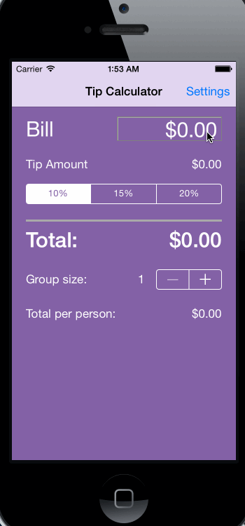

# Tip Calculator Demo

This is a simple tip calculator to assist users with calculating and splitting bills.

Time spent: 8-9 hours in total

## Completed user stories:

 * [x] Required: User can input a bill amount and see both the tip amount and total amount for three different tip percentages.
 * [x] Required: User can go to the settings page and change their three standard tip amounts (for bad, average, and great service, respectively). These modified tip amounts will persist across sessions.
 * [x] Optional: The app remembers the bill amount used most recently, except when the app was not used in the last 10 minutes.
 * [x] Optional: The app also includes a feature for groups to determine the amount each person should pay to split the bill.
 * [x] Optional: The app automatically updates all data while the user is typing.
 * [x] Optional: The app works flawlessly across different locales and handles commas, periods, and currency symbols correctly.
 * [x] Optional: Everything is purple! ;)

## Notes:

I chose to increase the font size of the bill amount since it's the only number the user actually inputs. I also moved the tip selector up higher to be right under the actual tip amount.

For the settings I chose to allow the user to change his/her default tip percentages, since I felt this was the setting where people would most likely have different preferences.

I spent the longest time on getting the calculator to work perfectly with any locale/currency. My eventual solution involved using an `NSNumberFormatter` in `NSNumberFormatterCurrencyStyle` mode with `lenient` set to `YES`. Using this actually enabled me to set up functions to parse numerical amounts out of strings and convert numbers into monetary strings. These functions ended up being **extremely** useful within my code, since they abstracted out most of the dirty work. (In general, I tried to abstract out redundant code wherever possible.)

## Walkthrough of all user stories:

GIF created with [LiceCap](http://www.cockos.com/licecap/).
